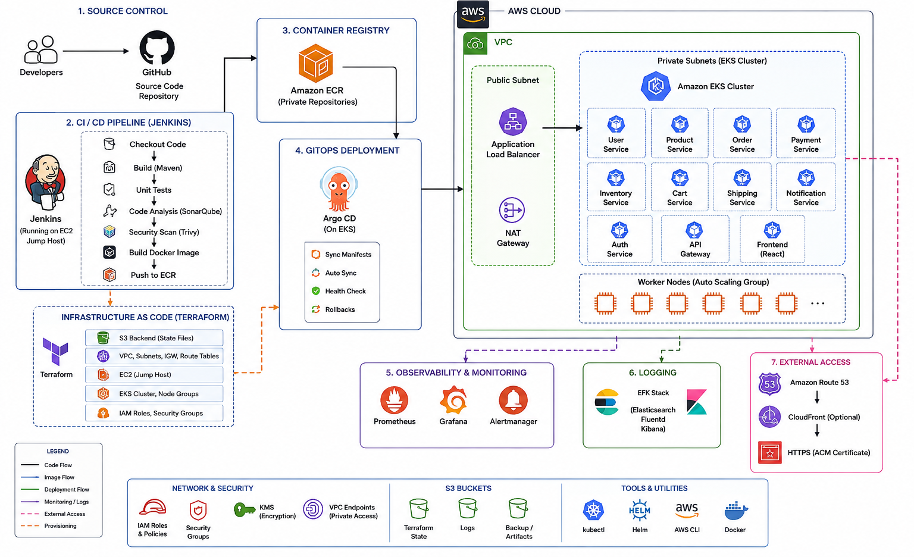

# AWS Microservices DevSecOps Platform


A complete **AWS Microservices DevSecOps platform** implementing Infrastructure as Code, CI/CD, containerization, Kubernetes orchestration, GitOps deployment, DNS, monitoring, alerting, and end-to-end validation.

---

## Table of Contents

- [Project Overview](#project-overview)
- [Objectives](#objectives)
- [Technology Stack](#technology-stack)
- [Platform Architecture](#platform-architecture)
- [End-to-End Workflow](#end-to-end-workflow)
- [Project Phases](#project-phases)
- [Infrastructure Architecture](#infrastructure-architecture)
- [CI/CD Architecture](#cicd-architecture)
- [GitOps Architecture](#gitops-architecture)
- [Monitoring Architecture](#monitoring-architecture)
- [Alerting Architecture](#alerting-architecture)
- [Repository Structure](#repository-structure)
- [Prerequisites](#prerequisites)
- [AWS Infrastructure](#aws-infrastructure)
- [Terraform](#terraform)
- [Amazon EKS](#amazon-eks)
- [Amazon ECR](#amazon-ecr)
- [Jenkins CI/CD](#jenkins-cicd)
- [Docker](#docker)
- [Kubernetes](#kubernetes)
- [Argo CD](#argo-cd)
- [Route 53](#route-53)
- [Prometheus](#prometheus)
- [Grafana](#grafana)
- [Alertmanager](#alertmanager)
- [Validation](#validation)
- [Evidence](#evidence)
- [Security](#security)
- [Troubleshooting](#troubleshooting)
- [Operational Checklist](#operational-checklist)
- [Project Outcome](#project-outcome)
- [Phase Completion](#phase-completion)

---

# Project Overview

This project demonstrates a complete DevSecOps implementation for a microservices-based application running on **Amazon EKS**.

The platform follows the complete lifecycle:



```text
Infrastructure
      |
      v
Terraform
      |
      v
AWS Infrastructure
      |
      v
Amazon EKS
      |
      v
Application Build
      |
      v
Docker
      |
      v
Amazon ECR
      |
      v
Jenkins CI
      |
      v
Kubernetes Manifests
      |
      v
GitOps Repository
      |
      v
Argo CD
      |
      v
Amazon EKS
      |
      v
Microservices
      |
      v
Route 53
      |
      v
Application
      |
      v
Prometheus
      |
      v
Grafana
      |
      v
Alertmanager
      |
      v
Operational Visibility
```

The objective is to build a platform where infrastructure, application delivery, deployment, monitoring, and alerting are integrated into a single DevSecOps workflow.

---

# Objectives

The project aims to demonstrate:

- Infrastructure as Code using Terraform
- AWS infrastructure provisioning
- Remote Terraform state management
- VPC and networking
- EC2 jump host
- Amazon EKS cluster
- Kubernetes worker nodes
- Amazon ECR container registries
- Docker image creation
- Jenkins CI pipelines
- Kubernetes application deployment
- Argo CD GitOps
- Route 53 DNS
- Application accessibility
- Prometheus monitoring
- Grafana dashboards
- Alertmanager alerting
- End-to-end CI/CD validation
- Operational troubleshooting
- Security validation
- Evidence-based project documentation

---

# Technology Stack

| Category | Technology |
|---|---|
| Cloud Provider | AWS |
| Infrastructure as Code | Terraform |
| State Management | Terraform Remote State |
| Networking | Amazon VPC |
| Compute | Amazon EC2 |
| Kubernetes | Amazon EKS |
| Containerization | Docker |
| Container Registry | Amazon ECR |
| CI/CD | Jenkins |
| Orchestration | Kubernetes |
| GitOps | Argo CD |
| DNS | Amazon Route 53 |
| Monitoring | Prometheus |
| Visualization | Grafana |
| Alerting | Alertmanager |
| Source Control | Git |
| CLI | AWS CLI |
| Kubernetes CLI | kubectl |
| Package Manager | Helm |

---

# Platform Architecture

```text
                         Developer
                             |
                             v
                       Git Repository
                             |
              +--------------+--------------+
              |                             |
              v                             v
        Terraform Code                 Application Code
              |                             |
              v                             v
        AWS Infrastructure             Jenkins CI
              |                             |
              |                             v
              |                       Docker Build
              |                             |
              |                             v
              |                         Amazon ECR
              |                             |
              |                             v
              |                    Kubernetes Manifest
              |                       Git Repository
              |                             |
              |                             v
              |                         Argo CD
              |                             |
              |                             v
              |                       Amazon EKS
              |                             |
              +-----------------------------+
                            |
                            v
                       Microservices
                            |
                            v
                       Load Balancer
                            |
                            v
                       Route 53 DNS
                            |
                            v
                     Application UI


                    Monitoring Layer

Amazon EKS
     |
     v
Prometheus
     |
     +-----------> Grafana
     |
     +-----------> Alertmanager
                         |
                         v
                    Notifications
```

---

# End-to-End Workflow

The complete application delivery workflow is:

```text
1. Developer
       |
       v
2. Git Repository
       |
       v
3. Jenkins
       |
       v
4. Docker Build
       |
       v
5. Docker Image
       |
       v
6. Amazon ECR
       |
       v
7. Kubernetes Manifest Update
       |
       v
8. GitOps Repository
       |
       v
9. Argo CD
       |
       v
10. Amazon EKS
       |
       v
11. Kubernetes Deployment
       |
       v
12. Application Service
       |
       v
13. AWS Load Balancer
       |
       v
14. Route 53
       |
       v
15. Application Domain
       |
       v
16. Application UI
```

Monitoring and alerting operate alongside the application:

```text
Kubernetes
     |
     v
Prometheus
     |
     +----------> Grafana
     |
     v
Alert Rules
     |
     v
Alertmanager
     |
     v
Notifications
```

---

# Project Phases

The implementation is organized into twelve phases.

| Phase | Component | Description |
|---|---|---|
| 01 | Architecture | Platform architecture and design |
| 02 | Terraform State | Terraform backend and state management |
| 03 | AWS Network | VPC, networking, and jump host |
| 04 | EKS | Amazon EKS cluster and worker nodes |
| 05 | ECR | Container repositories and images |
| 06 | Jenkins | CI/CD implementation |
| 07 | Kubernetes | Application deployment |
| 08 | Argo CD | GitOps implementation |
| 09 | Route 53 | DNS and application exposure |
| 10 | Monitoring | Prometheus and Grafana |
| 11 | Alerting | Alertmanager and alert rules |
| 12 | End-to-End | Complete platform validation |

Recommended documentation structure:

```text
docs/
├── 01-architecture/
├── 02-terraform-state/
├── 03-aws-network/
├── 04-eks/
├── 05-ecr/
├── 06-jenkins/
├── 07-kubernetes/
├── 08-argocd/
├── 09-route53/
├── 10-monitoring/
├── 11-alerting/
└── 12-end-to-end/
```

---

# Infrastructure Architecture

The AWS infrastructure provides the foundation for the platform.

```text
                         AWS
                          |
                          v
                    Amazon VPC
                          |
              +-----------+-----------+
              |                       |
              v                       v
        Public Subnets          Private Subnets
              |                       |
              v                       v
         Jump Host                 Amazon EKS
                                      |
                         +------------+------------+
                         |                         |
                         v                         v
                    Worker Nodes              Kubernetes
                                                   |
                                                   v
                                              Microservices
```

The infrastructure is provisioned using Terraform.

---

# CI/CD Architecture

Jenkins provides the continuous integration workflow.

```text
Developer
    |
    v
Git Repository
    |
    v
Jenkins
    |
    +----------------------+
    |                      |
    v                      v
Checkout                Build
                           |
                           v
                      Docker Build
                           |
                           v
                      Docker Image
                           |
                           v
                        Amazon ECR
```

Typical Jenkins microservice workflow:

```text
Checkout
   |
   v
Docker Build
   |
   v
Docker Image
   |
   v
Amazon ECR
   |
   v
Update Kubernetes Manifest
   |
   v
Git Push
```

---

# GitOps Architecture

Argo CD is responsible for maintaining the desired Kubernetes state.

```text
Application Code
       |
       v
     Jenkins
       |
       v
   Docker Image
       |
       v
   Amazon ECR
       |
       v
Kubernetes Manifest
Repository
       |
       v
     Argo CD
       |
       v
    Amazon EKS
       |
       v
 Kubernetes Workloads
```

The desired application state is stored in Git.

Argo CD continuously compares the desired state in Git with the actual state in Kubernetes.

---

# Monitoring Architecture

Prometheus collects metrics from Kubernetes and monitored workloads.

Grafana provides visualization.

```text
                         Kubernetes
                             |
              +--------------+--------------+
              |                             |
              v                             v
        Kubernetes Metrics             Node Metrics
              |                             |
              +--------------+--------------+
                             |
                             v
                        Prometheus
                             |
                           PromQL
                             |
                             v
                          Grafana
                             |
                             v
                       Monitoring UI
```

Monitoring provides visibility into:

- Kubernetes nodes
- Kubernetes pods
- Kubernetes workloads
- CPU utilization
- Memory utilization
- Network traffic
- Pod restarts
- Resource consumption
- Application availability

---

# Alerting Architecture

Alerting is implemented on top of Prometheus metrics.

```text
Kubernetes
    |
    v
Prometheus
    |
    v
Alert Rules
    |
    v
Condition Met
    |
    v
Alert = Firing
    |
    v
Alertmanager
    |
    +---------------------+
    |                     |
    v                     v
Alert Routing       Notifications
```

Alertmanager provides:

- Alert grouping
- Alert routing
- Alert deduplication
- Alert inhibition
- Notification delivery

Typical alert severities:

```text
INFO
 |
 +-- Informational condition

WARNING
 |
 +-- Potential operational issue

CRITICAL
 |
 +-- Immediate operational attention required
```

---

# Repository Structure

A recommended project structure is:

```text
.
├── README.md
│
├── docs/
│   ├── 01-architecture/
│   ├── 02-terraform-state/
│   ├── 03-aws-network/
│   ├── 04-eks/
│   ├── 05-ecr/
│   ├── 06-jenkins/
│   ├── 07-kubernetes/
│   ├── 08-argocd/
│   ├── 09-route53/
│   ├── 10-monitoring/
│   ├── 11-alerting/
│   └── 12-end-to-end/
│
├── evidence/
│   ├── 01-architecture/
│   ├── 02-terraform/
│   ├── 03-aws-network/
│   ├── 04-eks/
│   ├── 05-ecr/
│   ├── 06-jenkins/
│   ├── 07-kubernetes/
│   ├── 08-argocd/
│   ├── 09-route53/
│   ├── 10-monitoring/
│   ├── 11-alerting/
│   └── 12-end-to-end/
│
├── terraform/
│   └── ...
│
├── kubernetes/
│   └── ...
│
├── monitoring/
│   └── alert-rules/
│       ├── README.md
│       ├── kubernetes-alerts.yaml
│       ├── node-alerts.yaml
│       ├── pod-alerts.yaml
│       └── application-alerts.yaml
│
└── ...
```

The exact implementation directory structure may vary according to the project implementation.

---

# Prerequisites

Before deploying the platform, install and configure:

- AWS CLI
- Terraform
- Docker
- kubectl
- Helm
- Git
- Java
- Jenkins

Verify the tools:

```bash
aws --version
terraform version
docker --version
kubectl version --client
helm version
git --version
java --version
```

Verify AWS identity:

```bash
aws sts get-caller-identity
```

---

# AWS Infrastructure

The AWS infrastructure includes:

- Amazon VPC
- Public subnets
- Private subnets
- Availability zones
- EC2 jump host
- Amazon EKS
- Amazon ECR
- Route 53

Verify AWS region:

```bash
aws configure get region
```

Example:

```text
us-east-1
```

---

# Terraform

Terraform is used for Infrastructure as Code.

Initialize Terraform:

```bash
terraform init
```

Validate the configuration:

```bash
terraform validate
```

Create a plan:

```bash
terraform plan
```

Apply infrastructure:

```bash
terraform apply
```

Review Terraform state:

```bash
terraform state list
```

The Terraform state should be stored using the configured remote backend.

Sensitive information must never be committed to Git.

Do not commit:

```text
AWS credentials
Access keys
Private keys
Passwords
Secrets
Terraform state containing sensitive information
```

---

# Amazon EKS

Verify the EKS cluster:

```bash
aws eks describe-cluster \
  --region us-east-1 \
  --name twr-eks \
  --query 'cluster.status' \
  --output text
```

Expected:

```text
ACTIVE
```

Configure kubectl:

```bash
aws eks update-kubeconfig \
  --region us-east-1 \
  --name twr-eks
```

Verify context:

```bash
kubectl config current-context
```

Verify worker nodes:

```bash
kubectl get nodes
```

Expected:

```text
NAME                           STATUS   ROLES
<node-name>                    Ready    <none>
```

Verify Kubernetes system components:

```bash
kubectl get pods -n kube-system
```

---

# Amazon ECR

List repositories:

```bash
aws ecr describe-repositories \
  --region us-east-1 \
  --output table
```

Example microservice repositories:

```text
adservice
cartservice
checkoutservice
currencyservice
emailservice
frontend
paymentservice
productcatalogservice
recommendationservice
shippingservice
```

The actual repository list depends on the services implemented.

Verify images:

```bash
aws ecr describe-images \
  --repository-name <repository-name> \
  --region us-east-1 \
  --output table
```

---

# Jenkins CI/CD

Jenkins is responsible for the CI workflow.

Expected Terraform pipeline stages:

```text
Checkout
   |
   v
Terraform Version
   |
   v
Terraform Init
   |
   v
Terraform Validate
   |
   v
Terraform Plan
   |
   v
Terraform Apply
```

Microservice pipeline:

```text
Checkout
   |
   v
Docker Build
   |
   v
Docker Image
   |
   v
Amazon ECR
   |
   v
Update Kubernetes Manifest
   |
   v
Git Push
```

Successful Jenkins jobs should report:

```text
SUCCESS
```

---

# Docker

Docker is used to package microservices into container images.

Verify local images:

```bash
docker images
```

Authenticate with Amazon ECR:

```bash
aws ecr get-login-password \
  --region us-east-1 | \
docker login \
  --username AWS \
  --password-stdin <account-id>.dkr.ecr.us-east-1.amazonaws.com
```

Never store Docker registry credentials in source code.

---

# Kubernetes

Verify namespaces:

```bash
kubectl get namespaces
```

Verify deployments:

```bash
kubectl get deployments -A
```

Verify pods:

```bash
kubectl get pods -A
```

Verify services:

```bash
kubectl get services -A
```

Verify endpoints:

```bash
kubectl get endpoints -A
```

Check a deployment:

```bash
kubectl get deployment <deployment-name> \
  -n <application-namespace>
```

Check rollout:

```bash
kubectl rollout status deployment/<deployment-name> \
  -n <application-namespace>
```

Check logs:

```bash
kubectl logs <pod-name> \
  -n <application-namespace>
```

Healthy application pods should normally report:

```text
STATUS = Running
```

Investigate workloads in:

```text
Pending
CrashLoopBackOff
ImagePullBackOff
Error
ContainerCreating
```

states.

---

# Argo CD

Verify the Argo CD namespace:

```bash
kubectl get namespace argocd
```

Verify Argo CD pods:

```bash
kubectl get pods -n argocd
```

List Argo CD applications:

```bash
kubectl get applications \
  -n argocd
```

Expected conceptual state:

```text
SYNC STATUS     HEALTH STATUS
Synced          Healthy
```

The GitOps workflow is:

```text
Git
 |
 v
Jenkins
 |
 v
Docker Image
 |
 v
Amazon ECR
 |
 v
Kubernetes Manifest Repository
 |
 v
Argo CD
 |
 v
Amazon EKS
```

---

# Route 53

Verify hosted zones:

```bash
aws route53 list-hosted-zones \
  --output table
```

Verify DNS records:

```bash
aws route53 list-resource-record-sets \
  --hosted-zone-id <hosted-zone-id>
```

Verify DNS resolution:

```bash
nslookup pittylittle.shop
```

For the `www` hostname:

```bash
nslookup www.pittylittle.shop
```

The application should be accessible through the configured domain.

Example:

```text
http://pittylittle.shop
```

If configured:

```text
http://www.pittylittle.shop
```

---

# Prometheus

Prometheus provides metrics collection and querying.

Verify monitoring namespace:

```bash
kubectl get namespace monitoring
```

Verify Prometheus:

```bash
kubectl get pods -n monitoring | grep prometheus
```

Verify services:

```bash
kubectl get svc -n monitoring
```

Identify the Prometheus service:

```bash
kubectl get svc -n monitoring | grep prometheus
```

Port-forward Prometheus:

```bash
kubectl port-forward \
  -n monitoring \
  svc/prometheus-kube-prometheus-prometheus \
  9090:9090
```

Open:

```text
http://localhost:9090
```

Verify Prometheus targets:

```text
Prometheus
    |
    +-- Status
          |
          +-- Targets
```

Healthy targets should report:

```text
UP
```

Example PromQL queries:

```promql
up
```

```promql
node_uname_info
```

```promql
node_memory_MemAvailable_bytes
```

```promql
rate(node_cpu_seconds_total[5m])
```

The exact available metrics depend on the monitoring implementation.

---

# Grafana

Grafana provides visualization for Prometheus metrics.

Verify Grafana:

```bash
kubectl get pods -n monitoring | grep grafana
```

Verify the service:

```bash
kubectl get svc -n monitoring | grep grafana
```

Port-forward Grafana:

```bash
kubectl port-forward \
  -n monitoring \
  svc/prometheus-grafana \
  3000:80
```

Open:

```text
http://localhost:3000
```

Grafana should use Prometheus as its metrics data source.

Example internal Prometheus endpoint:

```text
http://prometheus-kube-prometheus-prometheus.monitoring.svc.cluster.local:9090
```

The actual service name should be obtained with:

```bash
kubectl get svc -n monitoring
```

Useful dashboards include:

- Kubernetes Cluster
- Kubernetes Nodes
- Kubernetes Pods
- Kubernetes Workloads
- Node Exporter
- Container Resources

---

# Alertmanager

Verify Alertmanager:

```bash
kubectl get pods -n monitoring | grep alertmanager
```

Verify the service:

```bash
kubectl get svc -n monitoring | grep alertmanager
```

Port-forward:

```bash
kubectl port-forward \
  -n monitoring \
  svc/prometheus-kube-prometheus-alertmanager \
  9093:9093
```

Open:

```text
http://localhost:9093
```

Verify PrometheusRule resources:

```bash
kubectl get prometheusrule -n monitoring
```

Example alert flow:

```text
Kubernetes Workload
        |
        v
     Metrics
        |
        v
   Prometheus
        |
        v
   Alert Rule
        |
        v
 Condition Met
        |
        v
 Alert = Firing
        |
        v
  Alertmanager
        |
        v
 Notification
```

---

# Alert Rules

Alert rules may be stored under:

```text
monitoring/alert-rules/
```

Recommended structure:

```text
monitoring/
└── alert-rules/
    ├── README.md
    ├── kubernetes-alerts.yaml
    ├── node-alerts.yaml
    ├── pod-alerts.yaml
    └── application-alerts.yaml
```

Example `PrometheusRule`:

```yaml
apiVersion: monitoring.coreos.com/v1
kind: PrometheusRule
metadata:
  name: kubernetes-alert-rules
  namespace: monitoring
spec:
  groups:
    - name: kubernetes-alerts
      rules:
        - alert: PodNotReady
          expr: kube_pod_status_ready{condition="false"} == 1
          for: 5m
          labels:
            severity: warning
          annotations:
            summary: "Kubernetes pod is not ready"
            description: "A Kubernetes pod has remained in a non-ready state for more than 5 minutes."
```

Apply:

```bash
kubectl apply \
  -f monitoring/alert-rules/kubernetes-alerts.yaml
```

Verify:

```bash
kubectl get prometheusrule -n monitoring
```

---

# Monitoring and Alerting Validation

Verify monitoring:

```bash
kubectl get pods -n monitoring
```

Prometheus:

```bash
kubectl get pods -n monitoring | grep prometheus
```

Grafana:

```bash
kubectl get pods -n monitoring | grep grafana
```

Alertmanager:

```bash
kubectl get pods -n monitoring | grep alertmanager
```

Node exporter:

```bash
kubectl get pods -n monitoring | grep node-exporter
```

Kube-state-metrics:

```bash
kubectl get pods -n monitoring | grep kube-state-metrics
```

---

# End-to-End Validation

The complete platform should be validated using the following workflow:

```text
Git Repository
      |
      v
Jenkins
      |
      v
Docker Build
      |
      v
Amazon ECR
      |
      v
Kubernetes Manifest
      |
      v
Argo CD
      |
      v
Amazon EKS
      |
      v
Microservices
      |
      v
AWS Load Balancer
      |
      v
Route 53
      |
      v
Application Domain
      |
      v
Application UI
```

At the same time:

```text
Amazon EKS
      |
      v
Prometheus
      |
      v
Grafana
      |
      v
Monitoring
```

And:

```text
Prometheus
      |
      v
Alert Rules
      |
      v
Alertmanager
      |
      v
Notifications
```

---

# End-to-End CI/CD Validation

A complete image update should follow:

```text
1. Modify application
        |
        v
2. Push code to Git
        |
        v
3. Jenkins detects/builds change
        |
        v
4. Docker image is built
        |
        v
5. Image pushed to ECR
        |
        v
6. Kubernetes manifest updated
        |
        v
7. Argo CD detects change
        |
        v
8. Argo CD synchronizes
        |
        v
9. EKS deployment updated
        |
        v
10. Application serves new version
```

This validates the complete CI/CD and GitOps workflow.

---

# Validation Commands

## AWS

```bash
aws sts get-caller-identity
```

```bash
aws configure get region
```

## EKS

```bash
aws eks describe-cluster \
  --region us-east-1 \
  --name twr-eks \
  --query 'cluster.status' \
  --output text
```

```bash
kubectl get nodes
```

## Kubernetes

```bash
kubectl get pods -A
```

```bash
kubectl get deployments -A
```

```bash
kubectl get services -A
```

## Argo CD

```bash
kubectl get applications -n argocd
```

## Monitoring

```bash
kubectl get pods -n monitoring
```

## Alerting

```bash
kubectl get prometheusrule -n monitoring
```

## DNS

```bash
nslookup pittylittle.shop
```

---

# Evidence

All implementation evidence should be stored under the project `evidence/` directory.

Recommended structure:

```text
evidence/
├── 01-architecture/
├── 02-terraform/
├── 03-aws-network/
├── 04-eks/
├── 05-ecr/
├── 06-jenkins/
├── 07-kubernetes/
├── 08-argocd/
├── 09-route53/
├── 10-monitoring/
├── 11-alerting/
└── 12-end-to-end/
```

Phase 12 should contain final validation evidence such as:

```text
evidence/12-end-to-end/

01-aws-account-validation.png
02-vpc-validation.png
03-jumphost-validation.png
04-terraform-validation.png
05-eks-cluster-active.png
06-eks-nodes-ready.png
07-ecr-repositories.png
08-ecr-images.png
09-jenkins-successful-build.png
10-docker-build.png
11-kubernetes-deployments.png
12-kubernetes-pods.png
13-kubernetes-services.png
14-argocd-applications.png
15-argocd-synced-healthy.png
16-route53-records.png
17-dns-resolution.png
18-application-ui.png
19-prometheus-targets.png
20-grafana-dashboard.png
21-alertmanager.png
22-alert-firing.png
23-end-to-end-cicd.png
24-final-platform.png
```

Evidence should demonstrate the successful implementation of each major platform component.

Do not capture or commit:

```text
Passwords
API tokens
AWS access keys
Private keys
Webhook secrets
SMTP credentials
Kubernetes Secret values
Jenkins credentials
Terraform sensitive state
```

---

# Security

Security validation is part of the final platform validation.

Verify that:

- AWS credentials are not stored in Git
- Jenkins credentials are stored securely
- Kubernetes Secrets are not committed
- Terraform state is protected
- IAM roles are used where appropriate
- EKS access is controlled
- Monitoring endpoints are not unnecessarily exposed
- Grafana authentication is enabled
- Prometheus is not publicly exposed without security controls
- Alertmanager is protected
- Sensitive information is not present in logs
- Sensitive information is not present in screenshots

Before publishing the repository, inspect the Git history and working tree for accidentally committed secrets.

---

# Git Repository Validation

Check repository status:

```bash
git status
```

Check remote:

```bash
git remote -v
```

Check branches:

```bash
git branch -a
```

Check recent commits:

```bash
git log --oneline -10
```

The repository should not contain:

```text
AWS access keys
Private keys
Passwords
Tokens
Terraform state files
Kubernetes secrets
Jenkins secrets
```

---

# Troubleshooting

## EKS nodes are not Ready

Check:

```bash
kubectl get nodes
```

Then:

```bash
kubectl describe node <node-name>
```

---

## Pod is not running

Check:

```bash
kubectl get pods -A
```

Inspect:

```bash
kubectl describe pod <pod-name> \
  -n <namespace>
```

Check logs:

```bash
kubectl logs <pod-name> \
  -n <namespace>
```

---

## ImagePullBackOff

Check:

```bash
kubectl describe pod <pod-name> \
  -n <namespace>
```

Verify:

- ECR repository
- Image name
- Image tag
- ECR authentication
- Kubernetes image configuration

---

## Argo CD is OutOfSync

Check:

```bash
kubectl get applications \
  -n argocd
```

Verify:

- Git repository
- Manifest changes
- Image tag
- Argo CD synchronization
- Kubernetes resource status

---

## DNS is not resolving

Check:

```bash
nslookup pittylittle.shop
```

Verify Route 53:

```bash
aws route53 list-resource-record-sets \
  --hosted-zone-id <hosted-zone-id>
```

---

## Prometheus has no metrics

Check:

```bash
kubectl get pods -n monitoring
```

Check targets in the Prometheus UI:

```text
Status
    |
    +-- Targets
```

Run:

```promql
up
```

---

## Grafana has no data

Verify:

- Grafana is running
- Prometheus is running
- Prometheus data source is configured
- Prometheus endpoint is correct
- Dashboard time range is correct
- PromQL queries return data

---

## Alert is not firing

Verify:

```bash
kubectl get prometheusrule -n monitoring
```

Check the PromQL expression directly in Prometheus.

Verify:

- Metric exists
- Condition is true
- Threshold is correct
- `for` duration has elapsed
- Prometheus targets are healthy

---

# Operational Checklist

Before considering the project complete:

```text
[ ] AWS infrastructure validated
[ ] Terraform configuration validated
[ ] Terraform state validated
[ ] Jump host validated
[ ] EKS cluster ACTIVE
[ ] EKS nodes READY
[ ] ECR repositories available
[ ] Docker images available
[ ] Jenkins pipelines successful
[ ] Kubernetes deployments available
[ ] Kubernetes pods Running
[ ] Kubernetes services available
[ ] Kubernetes endpoints available
[ ] Argo CD applications Synced
[ ] Argo CD applications Healthy
[ ] Route 53 DNS configured
[ ] Application domain resolves
[ ] Application UI accessible
[ ] Prometheus collecting metrics
[ ] Grafana dashboards working
[ ] Alert rules configured
[ ] Alertmanager working
[ ] Test alert validated
[ ] End-to-end CI/CD validated
[ ] Security checks completed
[ ] Evidence captured
[ ] Repository cleaned of secrets
```

---

# Final Validation Matrix

| Phase | Component | Validation |
|---|---|---|
| 01 | Architecture | Architecture documented |
| 02 | Terraform State | Backend verified |
| 03 | AWS Network | VPC and jump host verified |
| 04 | EKS | Cluster and nodes healthy |
| 05 | ECR | Repositories and images verified |
| 06 | Jenkins | CI pipelines successful |
| 07 | Kubernetes | Workloads healthy |
| 08 | Argo CD | Applications synchronized |
| 09 | Route 53 | DNS resolves correctly |
| 10 | Monitoring | Metrics and dashboards working |
| 11 | Alerting | Alerts and routing validated |
| 12 | End-to-End | Complete application flow validated |

---

# Disaster and Recovery Validation

Where appropriate, validate recovery from common failures.

Examples include:

- Pod failure
- Node failure
- Application container failure
- Deployment rollout failure
- Image pull failure
- Argo CD synchronization failure
- Jenkins build failure

For a controlled pod recovery test:

```bash
kubectl get pods -n <namespace>
```

Delete a test pod where appropriate:

```bash
kubectl delete pod <pod-name> \
  -n <namespace>
```

Watch the deployment recreate the pod:

```bash
kubectl get pods \
  -n <namespace> \
  -w
```

Destructive tests should not be performed against production infrastructure without explicit authorization.

---

# Rollback Validation

View deployment history:

```bash
kubectl rollout history deployment/<deployment-name> \
  -n <namespace>
```

Rollback when required:

```bash
kubectl rollout undo deployment/<deployment-name> \
  -n <namespace>
```

Verify:

```bash
kubectl rollout status deployment/<deployment-name> \
  -n <namespace>
```

For GitOps-managed environments, configuration changes should preferably be performed through Git and Argo CD rather than manually modifying the Kubernetes cluster.

---

# Complete Platform Architecture

The final platform can be represented as:

```text
                              AWS
                               |
                               v
                        Infrastructure
                               |
                         Terraform
                               |
                               v
                        Amazon VPC
                               |
                +--------------+--------------+
                |                             |
                v                             v
           Jump Host                      Amazon EKS
                                             |
                                    +--------+--------+
                                    |                 |
                                    v                 v
                               Kubernetes         Monitoring
                                    |                 |
                                    v                 v
                              Microservices      Prometheus
                                    |                 |
                                    v            +----+----+
                              Load Balancer       |         |
                                    |             v         v
                                    v          Grafana  Alertmanager
                               Route 53                     |
                                    |                       v
                                    v                  Notifications
                             Application UI
                                    ^
                                    |
                              GitOps Delivery
                                    |
                               Argo CD
                                    ^
                                    |
                         Kubernetes Manifests
                                    ^
                                    |
                                Jenkins
                                    |
                              Docker Build
                                    |
                                    v
                               Amazon ECR
```

---

# Complete DevSecOps Lifecycle

```text
                    +----------------------+
                    |      Developer       |
                    +----------+-----------+
                               |
                               v
                    +----------------------+
                    |    Git Repository    |
                    +----------+-----------+
                               |
                               v
                    +----------------------+
                    |       Jenkins        |
                    |        CI/CD         |
                    +----------+-----------+
                               |
                               v
                    +----------------------+
                    |    Docker Build      |
                    +----------+-----------+
                               |
                               v
                    +----------------------+
                    |      Amazon ECR      |
                    +----------+-----------+
                               |
                               v
                    +----------------------+
                    | Kubernetes Manifest  |
                    |     Git Repository   |
                    +----------+-----------+
                               |
                               v
                    +----------------------+
                    |       Argo CD        |
                    |       GitOps         |
                    +----------+-----------+
                               |
                               v
                    +----------------------+
                    |      Amazon EKS      |
                    +----------+-----------+
                               |
                               v
                    +----------------------+
                    |    Microservices     |
                    +----------+-----------+
                               |
                               v
                    +----------------------+
                    |      Route 53        |
                    +----------+-----------+
                               |
                               v
                    +----------------------+
                    |   Application UI     |
                    +----------------------+

Monitoring:

                    Amazon EKS
                        |
                        v
                    Prometheus
                        |
              +---------+---------+
              |                   |
              v                   v
           Grafana           Alert Rules
                                  |
                                  v
                             Alertmanager
                                  |
                                  v
                            Notifications
```

---

# Project Outcome

The completed implementation demonstrates a complete AWS microservices DevSecOps platform using:

```text
AWS
Terraform
Amazon VPC
Amazon EC2
Amazon EKS
Amazon ECR
Docker
Jenkins
Kubernetes
Argo CD
GitOps
Route 53
Prometheus
Grafana
Alertmanager
```

The platform implements the complete lifecycle:

```text
Infrastructure
      |
      v
Provisioning
      |
      v
CI
      |
      v
Containerization
      |
      v
Container Registry
      |
      v
GitOps
      |
      v
Kubernetes Deployment
      |
      v
Application Exposure
      |
      v
DNS
      |
      v
Monitoring
      |
      v
Alerting
      |
      v
Operational Validation
```

---

# Project Completion

The project is considered complete after:

- All infrastructure phases are validated
- CI pipelines successfully build microservice images
- Images are published to Amazon ECR
- Kubernetes workloads are deployed successfully
- Argo CD maintains the desired application state
- Route 53 provides application DNS resolution
- The application is accessible through the configured domain
- Prometheus collects operational metrics
- Grafana provides monitoring dashboards
- Alertmanager processes configured alerts
- End-to-end CI/CD is validated
- GitOps deployment is validated
- Security checks are completed
- Evidence is organized under the project evidence directory

---

# Documentation

Detailed implementation documentation is organized by phase:

```text
docs/
├── 01-architecture/
├── 02-terraform-state/
├── 03-aws-network/
├── 04-eks/
├── 05-ecr/
├── 06-jenkins/
├── 07-kubernetes/
├── 08-argocd/
├── 09-route53/
├── 10-monitoring/
├── 11-alerting/
└── 12-end-to-end/
```

Each phase contains the implementation details, validation procedures, commands, architecture diagrams, troubleshooting guidance, and evidence requirements for that stage.

---

# Evidence

Implementation evidence is organized under:

```text
evidence/
├── 01-architecture/
├── 02-terraform/
├── 03-aws-network/
├── 04-eks/
├── 05-ecr/
├── 06-jenkins/
├── 07-kubernetes/
├── 08-argocd/
├── 09-route53/
├── 10-monitoring/
├── 11-alerting/
└── 12-end-to-end/
```

The evidence directory provides proof of the implementation and final platform validation.

---

# Final Status

```text
Phase 01 — Architecture              Completed / Pending
Phase 02 — Terraform State           Completed / Pending
Phase 03 — AWS Network               Completed / Pending
Phase 04 — EKS                       Completed / Pending
Phase 05 — ECR                       Completed / Pending
Phase 06 — Jenkins CI                Completed / Pending
Phase 07 — Kubernetes                Completed / Pending
Phase 08 — Argo CD GitOps            Completed / Pending
Phase 09 — Route 53 DNS              Completed / Pending
Phase 10 — Monitoring                Completed / Pending
Phase 11 — Alerting                  Completed / Pending
Phase 12 — End-to-End Validation     Completed / Pending
```

---

# Conclusion

This project provides a complete reference implementation of an AWS-based microservices DevSecOps platform.

The platform integrates:

```text
Infrastructure as Code
        +
Continuous Integration
        +
Containerization
        +
Container Registry
        +
Kubernetes
        +
GitOps
        +
DNS
        +
Monitoring
        +
Alerting
        +
End-to-End Validation
```

The final architecture enables infrastructure provisioning, automated application builds, container image management, GitOps-based Kubernetes deployment, DNS-based application access, operational monitoring, and alert management.

```text
                    AWS
                     |
                     v
                 Amazon EKS
                     |
          +----------+----------+
          |                     |
          v                     v
      Workloads             Monitoring
          |                     |
          v                     v
     Application            Prometheus
          |                +----+----+
          v                |         |
       Route 53            v         v
          |             Grafana  Alertmanager
          v                         |
     Application UI                 v
                              Notifications
```

**AWS Microservices DevSecOps Platform — End-to-End Implementation**

```text
Infrastructure → CI → Containers → ECR → Kubernetes → GitOps
→ DNS → Monitoring → Alerting → Validation
```
# 👨‍💻 Author

## Rushikesh Sutar

**DevSecOps Engineer — DevSecOps | Cloud | Kubernetes | Terraform | AWS | GCP**

### GitHub

https://github.com/sutar-rushikesh

### LinkedIn

https://www.linkedin.com/in/devopwithrushikesh/

---

# ⭐ Support

If you find this project useful:

* ⭐ Star the repository
* 🍴 Fork the repository
* 📢 Share it with the DevOps community
* 🤝 Connect with me on LinkedIn

---

# 📜 License

This project is intended for **educational, portfolio, and technical demonstration purposes**.

---

## ❤️ Thank You

Thank you for visiting this repository.

---